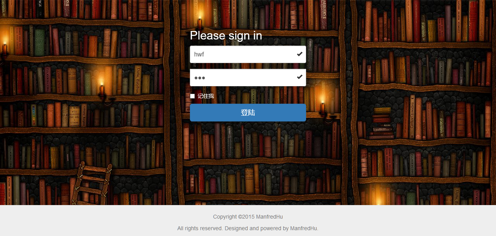
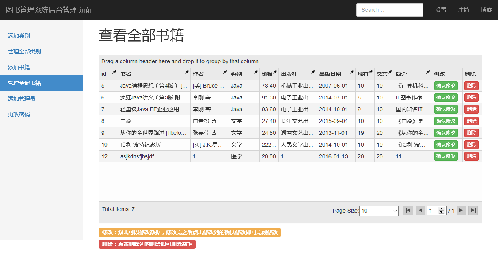

# books-management-system
使用MySQL+ExpressJS+AngularJS+NodeJS尝试开发的图书管理系统，开发前端后台模块，后台用ExpressJS和NodeJS搭建服务器，前端用AngularJS，样式用的Bootstrap。自己封装了数据库连接池的接口，利用Java项目MVC的思想组织后台，用Ajax传递前后台数据。




- *AngularJS用到了*:ng-grid,ui-router,ng-file-upload等模块
- *ExpressJS用到了*:body-parser,cookie-parser,cookie-session,ejs,express-session,MD5加密等模块


## 运行

1. 载入sql文件夹的sql部分
2. 项目根目录装载`npm install`
3. `cd app`进入app目录
4. `node app.js`启动服务器或者`grunt`直接进入配置好`nodemon`和`watch`的开发环境
5. 浏览器输入`localhost:9000`进入


## 目录详解
docsFile为项目接口规范
app为项目目录，包含前端与后台

```
app
├──controller	后台的controller部分
	├──AdminCtrl.js 管理员的controller部分
	├──UserCtrl.js	用户的controller部分
	├──config.js 刚开始是为了表单解决跨域的问题，后面写成一个服务器就用不上了
├──dao	数据处理层，实现对对应model的增删查改等等
	├──BookDao.js 书籍的Dao封装
	├──BookTypeDao.js 书籍类别的Dao封装
	├──UserDao.js 用户的Dao封装
├──db	封装的数据库连接池部分
	├──connection.js 数据库连接池封装
	├──DBconfig.js MySQL数据库配置
├──lib	项目引用的库
	├──angular-1.3 angular文件
	├──bootstrap-3.3.6 bootstrap样式
	├──bootstrap-select-1.9.3 用到了select下拉框的动态加载，所以另外引用了样式文件
	├──ng-file-upload-master angular的图片上传模块
	├──angular-ui-router.js ui-router部分，因为有侧边栏，我用到了分割组件的思想分成了顶部导航，侧边栏和主内容区三部分
├──model
	├──Model.js	Java的理解是实体类，不过项目很多都是直接传对象的，没用到，不过数据定义在这个文件，方便理解和查看
├──static 静态文件，包含JS和CSS文件，可以用Grunt或者Gulp压缩混淆
	├──scripts
		├──controllers 前端controllers部分
			├──admin.js 管理员模块的controller部分
			├──login.js 登陆模块的controller部分
		├──adminApp.js 管理员模块的前端路由定义
		├──app.js 登陆模块的前端路由定义
	├──styles 样式文件
├──test 后台接口测试部分，对DAO进行接口测试
├──views 项目的模板，或者说叫视图部分，代码基本在前端controller里面
├──app.js 服务器启动文件
├──routes.js 后台路由配置文件
```

## 一些问题
express-session模块中[官方文档](https://github.com/expressjs/session?_ga=1.2960176.1066105876.1451139756)是

```javascript
app.use(session({
        secret: 'manfredHu', //加密
        resave: false,
        saveUninitialized: true
    }));
```

但是这样会报错，stackOverflow上面是下面这样的，居然可以了-_-!!


```javascript
app.use(expressSession({
        secret: 'manfredHu', //加密
        resave: false,
        saveUninitialized: true
    }));
```
